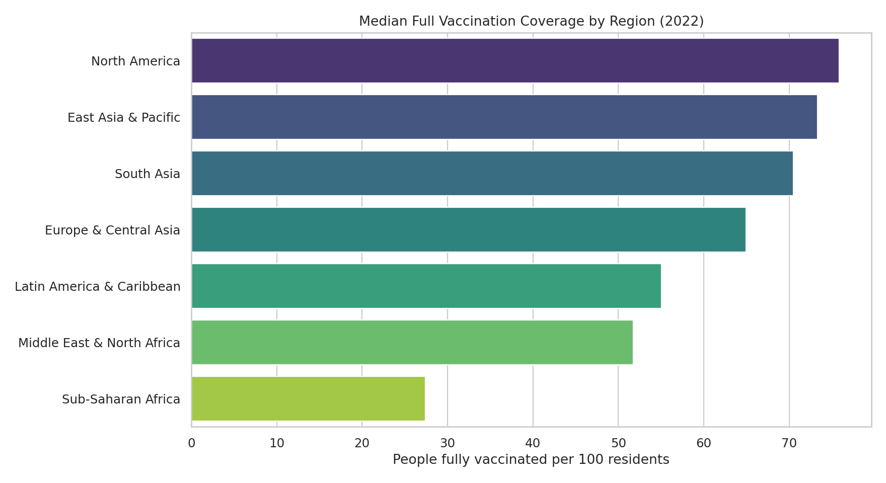

# Global Public Health Equity Analysis

[](https://github.com/kavita355321/Public-Health-Data-Analysis/actions/workflows/python-tests.yml)

An end-to-end Python analysis of global COVID-19 vaccination coverage, health expenditure and reported mortality. The project combines Our World in Data and World Bank data, validates country-year records, produces reproducible summary tables and creates portfolio-ready visualisations.

> **Headline result:** In the latest sufficiently complete comparison year (2022), 184 countries had all three core measures available. Median full-vaccination coverage was 54.88 people per 100 residents, but the median ranged from 72.85 in high-income economies to 18.98 in low-income economies.



## Questions answered

- How did full-vaccination coverage vary across regions and income groups?
- Was health expenditure associated with vaccination coverage?
- Which countries combined stronger vaccination coverage and health spending with lower reported mortality?
- What would a simple continuation of India's historical vaccination trend look like, and why should it not be treated as a forecast?

## Key findings

- The global median full-vaccination level was **54.88 per 100 residents** across 184 complete country records in 2022.
- High-income economies recorded a median of **72.85**, compared with **18.98** for low-income economies—a **53.87 percentage-point gap**.
- East Asia & Pacific had the highest regional median vaccination coverage at **73.33**, while Sub-Saharan Africa had the lowest at **27.39**.
- Health spending and vaccination coverage had a **modest positive correlation (r = 0.31)**. This is an association, not evidence that spending alone caused vaccination outcomes.
- The India trend component has only four annual observations and an in-sample R² of **0.60**. It is therefore presented as an illustrative scenario, not a production forecast.

## Analytical approach

1. Read the compressed OWID daily data and retain genuine three-letter country records.
2. Aggregate daily observations to one country-year row.
3. Reshape World Bank health expenditure data from wide to long format.
4. Join datasets using ISO-3 country code and year, then attach region and income classifications.
5. Select the most recent year with at least 100 complete country observations; this yields 2022.
6. Produce regional, income-group and country summaries without replacing missing observations with zero.
7. Generate five comparison charts plus an explicitly labelled India trend scenario.

The exploratory index uses percentile ranks:

\[
\text{Index} = 0.45(\text{vaccination}) + 0.25(\text{health spending}) + 0.30(\text{inverse reported mortality})
\]

The weights are analyst-defined for exploration. The index is not an official public-health measure and should not be used to make policy or funding decisions. See [methodology](docs/METHODOLOGY.md) for the full interpretation.

## Visual outputs

| Analysis | Preview |
|---|---|
| Health spending vs vaccination | [Open chart](outputs/figures/spending_vs_vaccination.png) |
| Exploratory index comparison | [Open chart](outputs/figures/equity_index_comparison.png) |
| Health spending by income group | [Open chart](outputs/figures/spending_by_income_group.png) |
| Correlation heatmap | [Open chart](outputs/figures/correlation_heatmap.png) |
| India trend scenario | [Open chart](outputs/figures/india_vaccination_trend_scenario.png) |

## Repository structure

```text
.
├── data/
│   ├── raw/                 # Source snapshots
│   └── processed/           # Rebuilt country-year dataset
├── docs/                    # Methodology and field definitions
├── outputs/
│   ├── figures/             # Generated PNG charts
│   └── *.csv                # Reproducible analysis tables
├── src/                     # ETL, analysis and visualisation modules
├── tests/                   # Unit tests for key transformations
├── run_pipeline.py          # One-command workflow
└── requirements.txt
```

## Run locally on Windows

```powershell
py -m venv .venv
.venv\Scripts\activate
python -m pip install -r requirements.txt
python run_pipeline.py
python -m pytest -q
```

Successful execution should report:

```text
Pipeline complete: 1,178 country-year rows; 184 countries in the 2022 comparison.
```

## Data sources

- [Our World in Data COVID-19 dataset](https://ourworldindata.org/coronavirus) — vaccination, cases, deaths and population.
- [World Bank: Current health expenditure (% of GDP)](https://data.worldbank.org/indicator/SH.XPD.CHEX.GD.ZS) — indicator `SH.XPD.CHEX.GD.ZS`.
- World Bank country metadata — region and income-group classifications included with the indicator download.

The source files are snapshots committed for reproducibility. Details are recorded in [data/README.md](data/README.md).

## Limitations

- Cross-country reporting quality and COVID-19 testing/death definitions differ.
- A cross-sectional correlation cannot establish causality.
- Health spending as a share of GDP is not the same as spending per person or vaccine-programme funding.
- Percentile ranks and analyst-selected weights make the exploratory index sensitive to the comparison set and assumptions.
- The trend scenario uses too few annual observations for reliable forecasting and does not model saturation, policy changes or new variants.

## Quality controls

- Missing analytical values are excluded rather than silently converted to zero.
- Aggregate OWID regions are excluded from country comparisons.
- Country-year uniqueness is validated in the ETL stage.
- Vaccination coverage is constrained to the valid 0–100 range.
- Five unit tests cover filtering, reshaping, year selection, scoring and missing-data behaviour.
- GitHub Actions runs the tests and complete pipeline on every push and pull request.

## Author

**Kavita** — Data Analyst & Web Developer  
[GitHub profile](https://github.com/kavita355321)

